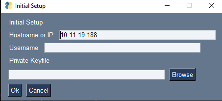
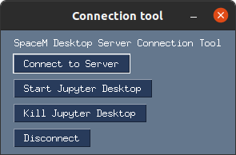

# SpaceM Jupyter Desktop Connection Tool

# About

This repo contains the SpaceM Jupyter Desktop Connection tool.
This tool facilitates the connection to the virtual desktop solution running
on the SpaceM workstation (this is currently also Sergio's workstation,
so be mindful of resources)/

# Shared Resource - Sergio's Workstation

Note that Sergio's Workstation is a shared resource. **Be mindful of others, who may
also be using the machine, in particular of Sergio. If necessary, coordinate use via
Slack. Don't fill up the persistent folders with tons of data**.

# Documentation for Users

## Download / Installation

### Windows 

There is a Windows binary executable of this app.
You can download it from [this EMBL owncloud link](https://oc.embl.de/index.php/s/DMOTTmQpr5DSFlq).
This should run out of the box (unless your download manager or virus scanner interferes).

### Other Platforms

For other platforms there is currently no binary.
Create a python environment (conda or venv) with `Python >= 3.7` 
and pip install the following dependencies

```
paramiko
dataclasses_json
pysimplegui
```

You can then launch the code in folder `connection_tool`
using `python ssh_connect_gui.py`. 

## First start

When you first launch the tool, you will be prompted to create a configuration.
For this you will need your username and a key file (contact Volker via Slack for these).
The IP address of the server is pre-filled with the current default, but can be changed
if it becomes necessary.

The dialog should be fairly self explanatory:



Once you have finished, there will be a `.json` file in the same folder as your executable (or python
script) that holds the settings. Do not change the location of your key file. 


## Connection

Once the config file has been created, on subsequent starts of the tool you will be
greeted by this minimalistic interface:




[This screen recording shows the tool and the desktop in action](https://slack-files.com/T07TPNGTC-F01PSQNPNBH-e310f22543).


* Note that there is no status indicator for the connection (maybe this will be added later).
* Closing the connection to the server does not kill the desktop. You will continue to use resources. On the other hand this can be useful as you don't need to stay connected for long computations. 
* Killing the jupyter desktop server will kill the Desktop without warning. Make sure you copy all results
to a secure location. 


## In the "container" workspace

The pre-configured desktop runs in a Docker container (similar to a virtual machine).
Within the container image your username will be `jovyan`, as this container image builds
on [somebody else's existing work](https://github.com/yuvipanda/jupyter-desktop-server).

### Everything will be fresh on your next login !

While you can create files in the local folders in the Desktop environments and work
with those, all these files will be gone when you log out and you will start with a clean slate
on your next login. **BE SURE TO COPY IMPORTANT RESULTS AT THE END OF THE SESSION!**, either
to the group share (backed up, safe) or the persistent folders on the workstation (not backed up,
unsafe).

### Pre-installed software

* **SpaceM** is already pre-installed. You can open a terminal, run `conda activate spacem` and then start `SpaceM`.
* **napari** the napari viewer is pre-installed. Open a terminal and type `napari`.
* **Nikon mosaic viewer tool** will be added in the coming days.

Let me know if you think there are other tools that are relevant to all users and should be pre-installed. For installing your own scripts and software, see below.

### Mapping the group share

In the file manager, go to the address bar and type 
```sftp://youremblusername@datatransfer.embl.de:/g/scb/alexandr`, with your actual EMBL ident.
You will be prompted for the password and then you can browse the files. Note that drag and drop
will not work for files mounted in that way. You will have to copy the files to a local folder.
(This will typically be very fast).

![./resources/map_groupshare.png]

### (Semi-)Persistent user folders on the machine

You will find a folder named `shared_*your_user_name*` in the home directory of the `jovyan` user
on the container. This folder is mapped to a persistent folder on Sergio's machine. Data and software
you install there should persist between sessions. Due to the permissions these files can potentially
be read, modified and deleted by other users of the machine, so don't treat this as a secure backup.

### Installing software, creating conda environments

You can install software in your persistent folder location, e.g. Fiji by copying it there after unpacking and download.

If you want to create your own conda environment you can create it there with the `--prefix` option and it will be persistent, e.g. `conda create --prefix ~/share_yourusername_here/mycondeenvironment python=3.7` and activate it with `conda activate ~/share_yourusername_here/mycondeenvironment`.

### GPU

The Docker environment supports CUDA. Currently there is not much GPU RAM. If one user runs something with pytorch or tensorflow, there will be no GPU RAM for other users, so coordinate among you.


## Changing settings

If you need to change your settings (e.g. because you moved your key file to a new location), delete the `connection_settings.json` file.


# Documentation for Admins

## Creating new users on the server

Run (using `sudo`) the script in `admin_scripts`.

## Docker run script

See `server_scripts`. On the server, this is stored in `/etc/spacem_jupyter_desktop`. 


